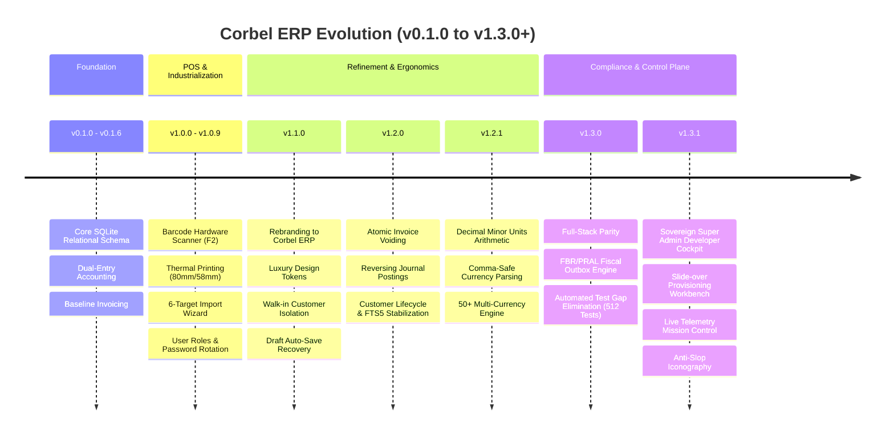

# Corbel ERP — Master Release Notes & System Manifest

**Product**: Corbel ERP (The Sovereign Financial & Commercial Desktop Core)  
**Parent Identity**: The Foolish Crow (Studio of Taha Asadullah)  
**Current Milestone**: v1.3.0+ (SaaS Command Deck & Multi-Tenant Sovereign Isolation)  
**Release Commander**: Nadia Al-Mansoor (`ALMANSOOR-REL`), Gate 7: Definition of Release Governance (DoRG)  
**Coordinated By**: Alexander Cross (`CROSS-DIR`), Steward of Crow Parliament  
**SDLC Phase Gate**: All Gates Verified (DoR, DoAC, DoDE, DoCC, DoQV, DoSA, DoOR, DoRG)  
**Verification Baseline**: 534/534 Rust Integration Tests Passing · 0 TypeScript Compilation Errors  

---

## 1. Executive Summary

**Corbel ERP** is a single-tenant desktop enterprise resource planning (ERP) and Point of Sale (POS) application built for modern wholesale, retail, and manufacturing enterprises in Pakistan. Designed to run offline-first with zero cloud latency, Corbel combines high-density counter cashiering, strict FIFO inventory and batch expiry management, double-entry accounting ledgers, multi-format legacy data migration, zero-knowledge multi-tenancy, and full compliance with Pakistan's **Federal Board of Revenue (FBR / PRAL)** digital fiscal invoicing mandate.

The platform is engineered with a memory-safe, ultra-low-overhead architecture:
* **Frontend**: React 19, TypeScript, Mantine 9, Vite 7, Framer Motion, Tabler / Lucide Icons.
* **Backend Runtime**: Rust (2021 edition), Tauri 2, Tokio async runtime, sqlx 0.9.
* **Data Storage**: SQLite 3 with Write-Ahead Logging (`WAL`), Foreign Key constraints, and FTS5 full-text search.
* **Security & Auth**: Argon2id & bcrypt password hashing, token version revocation, role-based permission matrices, PECA 2016 immutable audit logs, and client-side payment idempotency deduplication.

---

## 2. Release Progression & Version Matrix



| Version | Release Date | Key Themes & Milestone Deliverables | Verification Gate |
| :--- | :---: | :--- | :---: |
| **`v1.3.1`** | **October 2026** | **Sovereign Developer Cockpit & Dynamic Telemetry**: Ergonomic slide-over Tenant Provisioning Workbench drawer replacing popup modals; live cross-tenant telemetry KPIs (MRR, tenant count, fleet users); measured database pool round-trip latency probes; live audit event activity calendar & 7-day volume; interactive developer directives console (`ping`, `stats`, `audit`, `update`); persistent operator quests; Tauri auto-updater client; custom avatar & profile switcher; anti-slop SVG iconography. | **Gate 7 (DoRG)** |
| **`v1.3.0`** | **October 2026** | **Full-Stack Parity & Fiscal Engine**: Complete FBR tax credential synchronization across DB, Rust DTOs, and UI forms; client payment idempotency deduplication across IPC; automated FBR and notification test suites (512 green tests). | **Gate 4 (DoQV)** |
| **`v1.2.1`** | **September 2026** | **Currency Normalization & Stability**: Eliminated `parseFloat` comma truncation; integrated live multi-currency exchange rates (50+ fiat currencies); stabilized Linux Wayland/WebKitGTK rendering. | **Gate 3 (DoCC)** |
| **`v1.2.0`** | **September 2026** | **Invoice Voiding & State Machine**: Atomic invoice cancellation with reversing accounting entries and automatic inventory restoration; active/inactive customer lifecycle; canonical FTS5 external content triggers. | **Gate 2 (DoAC)** |
| **`v1.1.0`** | **September 2026** | **Sovereign Rebranding & POS Ergonomics**: Rebrand from Ijaz & Company to Corbel ERP; high-density cash-first POS layout; POS walk-in customer (ID: 0) credit isolation; draft auto-save recovery. | **Gate 2.5 (DoDE)** |
| **`v1.0.0`** | **August 2026** | **Production General Availability**: Hardware barcode scanner integration (`F2`); 80mm & 58mm zero-margin thermal printing; 6-target file import wizard (Excel, CSV, Word, PDF, OCR); forced first-login password rotation. | **Gate 1 (DoR)** |

---

## 3. Core Functional Domains & Capabilities

### 3.1. High-Density Point of Sale (POS) & Counter Workflows
* **Zero-Latency Hardware Barcode Scanning**: Dedicated scanner listener bound to the global `F2` hotkey with instant barcode resolution, keyboard emulation buffering, and synthesized Web Audio feedback tones for successful and error scans.
* **Direct Thermal Printing**: Continuous receipt generation optimized for standard 80mm and 58mm thermal rolls, utilizing zero-margin CSS and raw text printing without header/footer page decorations.
* **Instant Cashier Ergonomics**: Quick-cash tender buttons (PKR 500, 1000, 5000), real-time change calculation, one-click checkout, and optional customer Khata credit charging.
* **WhatsApp Bill Dispatch**: Direct generation of formatted digital receipt links shared via WhatsApp Web / desktop application without requiring paid SMS gateways.

### 3.2. Invoicing, Payments & Settlement Lifecycle
* **Atomic State Transitions**: Strictly enforced transition graph:
  $$\text{Draft} \longrightarrow \text{Finalized} \longrightarrow \text{Partially Paid} \longrightarrow \text{Paid}$$
  $$\text{Finalized} \longrightarrow \text{Voided (Reversed)}$$
* **Transactional Stock Deduction**: Stock levels are deducted within an atomic database transaction at the exact instant an invoice is finalized. Voiding an invoice immediately executes a compensating stock increment and generates reversing journal entries.
* **Double-Click Idempotency Protection**: Client-generated UUID idempotency keys are transported across Tauri IPC boundaries to ensure cashiers cannot accidentally duplicate payments during rapid checkout.
* **Multi-Format Stationery**: Built-in visual designs: `wholesale_a4`, `thermal_80mm`, `thermal_58mm`, `compact_a5`, plus dynamic user-uploaded `.xlsx` templates with placeholder tokens (`{{invoice_number}}`, `{{customer_name}}`, `{{grand_total}}`).

### 3.3. FBR / PRAL Digital Fiscal Invoicing
* **Transactional Outbox Architecture**: Invoices destined for FBR fiscal verification are queued in SQLite outbox tables, isolating counter cashiers from external network latency or PRAL server outages.
* **Exponential Backoff & Dead-Letter Queue**: Outbox workers retry submissions on a deterministic exponential schedule (0s $\rightarrow$ 2m $\rightarrow$ 10m $\rightarrow$ 30m $\rightarrow$ 2h) before moving to a dead-letter quarantine after 5 failed attempts.
* **Compliant Cryptographic Signatures & QR Codes**: Real-time generation of 16-character Invoice Reference Numbers (IRN) and compliant 2D QR codes linking directly to the FBR verification portal.
* **Provincial Tax Jurisdictions**: Dynamic tax engine supporting Federal FBR alongside provincial authorities (PRA - Punjab, SRB - Sindh, KPRA - Khyber Pakhtunkhwa, BRA - Balochistan, ICT - Islamabad).

### 3.4. Inventory & Expiry Batch Supply Chain
* **Rich Product Catalog**: Barcode management, SKU prefix generation, tax eligibility toggles, unit definitions, category grouping, and customizable company-specific metadata fields.
* **Paisa-Based Integer Arithmetic**: Product unit costs and selling prices are calculated and stored in integer minor units (paisa) to eradicate IEEE 754 floating-point rounding errors.
* **Expiry Batch Governance**: FIFO (First-In, First-Out) stock tracking with automated batch expiry warnings (30/60/90 days) and automated batch assignment upon purchase order receiving.
* **Purchase Order Lifecycle**: Atomic PO numbering, supplier quote submission, partial/full stock-in receiving, and accounts payable ledger posting.

### 3.5. General Ledger & Double-Entry Accounting
* **Seeded Chart of Accounts**: Automated structure conforming to standard GAAP (Assets, Liabilities, Equity, Revenue, Cost of Goods Sold, Operating Expenses).
* **Automatic Dual-Entry Posting**:
  * Finalizing an invoice credits *Sales Revenue* and debits *Accounts Receivable* (or *Cash on Hand*).
  * Voiding an invoice debits *Sales Revenue* and credits *Accounts Receivable*.
  * Recording payments debits *Cash/Bank* and credits *Accounts Receivable*.
* **Real-Time Financial Reporting**: Automatic generation of Balance Sheets, Profit & Loss Statements (P&L), Trial Balances, and Customer Ledger Statements with PDF and CSV export affordances.

### 3.6. Customer Khata & Walk-in Separation
* **The Walk-in Ledger Firewall**: Walk-in Customer (ID: 0) sales settle immediately as cash-on-hand transactions and are barred from accumulating debt or polluting credit Khata accounts.
* **Customer Khata Management**: Comprehensive customer profiles tracking NTN, STRN, CNIC, buyer types (Registered, Unregistered, Wholesaler), credit limits, and historical ledger statements.
* **Lifecycle Toggling**: Full active/inactive state support with non-destructive archival, safeguarding historic transaction traceability while preventing deactivated customers from appearing in active cashier searches.

### 3.7. Multi-Format Data Import Wizard
* **6 Ingestion Formats**: Ingests legacy business data from CSV, Microsoft Excel (`.xls`, `.xlsx`), Word (`.docx`), PDF extracts, and scanned images via Tesseract OCR.
* **6 Operational Targets**: Products, Customers, Suppliers, Opening Stock Balances, Historical Sales Invoices, and Purchase Bills.
* **Deterministic Conflict Strategies**: Cashier choice of *Skip Duplicate*, *Overwrite Existing Record*, or *Create with Suffix*.
* **24-Hour Non-Destructive Rollback**: Every import execution is logged in a discrete batch; administrators can execute a complete rollback within 24 hours to restore the database to its pre-import state.

### 3.8. Sovereign Multi-Tenant Super Admin Command Deck
* **Zero-Knowledge Multi-Tenant Privacy**: Platform analytics are architecturally decoupled from tenant business data. Super Admin queries are restricted to subscription MRR/ARR, tenant health, user seat counts, and plan quotas. Super Admin **never** queries or inspects private tenant invoices, customer identities, or financial balances.
* **Tactile Anti-Slop Visual Ergonomics**: Developed by Julian Mercer (`MERCER-UX`) following strict WCAG 2.2 AA contrast principles. Replaced low-contrast translucent sludge with solid, crisp Slate-800 surfaces (`#162035`), Slate-700 borders (`#2E4066`), and high-visibility pure white typography (`#FFFFFF`).
* **Root Mantine Scheme Synchronization**: Direct integration with Mantine's root `useMantineColorScheme()`, eliminating nested provider styling conflicts across modals, drawers, and input controls.
* **Core vs. Optional Module Locking**:
  * **Core System (Locked Active)**: `inventory`, `invoices`, `settings` are permanently enabled (`disabled={true}`, badged with *Core System* lock) across both tenant settings and the Super Admin drawer to protect operational continuity.
  * **Toggleable Add-ons**: `dashboard`, `pos`, `purchase_orders`, `reports`, `fbr`, `ledger`, `import`, `users` are freely configurable per tenant.
* **Dedicated Master Password Rotation**: Built-in security card in Platform Settings allowing the Super Admin to update temporary bootstrap passwords to permanent passwords via `changeMyPassword`.

---

## 4. Security, Compliance & Data Integrity

1. **Authentication & Identity**:
   * Passwords hashed using Argon2id and bcrypt with salt rounds $> 10$.
   * Instant credential revocation via integer `token_version` tracking in SQLite sessions.
   * Compulsory first-login password rotation for newly provisioned user accounts.
2. **Statutory Compliance**:
   * **PECA 2016 (Prevention of Electronic Crimes Act)**: Immutable, append-only security audit log recording user ID, action, resource, timestamp, and network IP.
   * **Electronic Transactions Ordinance (ETO 2002)**: 5-year compliance retention engine with automated purge analysis and owner-only archival.
3. **Database Integrity & Search**:
   * SQLite FTS5 triggers engineered using canonical `'delete'` syntax (`INSERT INTO fts(fts, rowid, ...) VALUES('delete', ...)`) to prevent disk image corruption (`code: 267`).
   * Foreign key enforcement enabled by default on all connections (`PRAGMA foreign_keys = ON;`).

---

## 5. SQLite Migration Ledger

The Corbel ERP database evolves deterministically across 21 sequential migrations:

| Migration | File | Core Tables & Architectural Impact |
| :---: | :--- | :--- |
| `001` | `001_create_users.sql` | `users` table, password hashes, roles (`owner`, `admin`, `employee`), token versioning. |
| `002` | `002_create_companies.sql` | `companies` table, currency settings, business profiles. |
| `003` | `003_create_inventory.sql` | `categories`, `suppliers`, `products`, `stock_movements`. |
| `004` | `004_create_invoices.sql` | `customers`, `invoices`, `invoice_items`, `invoice_payments`. |
| `005` | `005_persistent_session.sql` | `persistent_sessions` table for cross-restart authentication tokens. |
| `006` | `006_expiry_batches.sql` | `product_batches` table for FIFO batch and expiry date tracking. |
| `007` | `007_purchase_orders.sql` | `purchase_orders`, `purchase_order_items`, receiving workflows. |
| `008` | `008_audit_log.sql` | `audit_logs` table for PECA 2016 statutory immutable event tracking. |
| `009` | `009_soft_delete_versioning.sql` | `deleted_at` soft-delete columns and optimistic locking `version` counters. |
| `010` | `010_fts5_search.sql` | FTS5 full-text search virtual tables and canonical content triggers. |
| `011` | `011_theme_settings.sql` | Company-wide stationery themes, logo BLOBs, and color preferences. |
| `012` | `012_accounting_ledger.sql` | `accounts` (Chart of Accounts), `journal_entries`, `journal_lines`. |
| `013` | `013_custom_roles.sql` | `custom_roles` and `role_permissions` granular security matrices. |
| `014` | `014_import_batches_and_units.sql`| `import_batches` and custom product `units` with fractional scales. |
| `015` | `015_invoice_designs.sql` | User invoice stationery templates and footer metadata configurations. |
| `016` | `016_import_jobs_target.sql` | Background import jobs queue, target types, and rollback tracking. |
| `017` | `017_saas_infrastructure.sql` | `packages`, `company_subscriptions`, `company_modules`, `tenant_feature_flags`. |
| `018` | `018_multi_currency.sql` | Multi-currency invoice exchange rates and FX ledger accounting tables. |
| `019` | `019_fbr_integration.sql` | `fbr_queue`, `fbr_logs`, PRAL submission state, and QR code caches. |
| `020` | `020_invoice_signatures_and_balance.sql` | Invoice signature visibility and customer balance display toggles. |
| `021` | `021_product_barcode_description.sql` | Product barcode and extended multiline description columns. |

---

## 6. Verification & Quality Assurance Evidence

In accordance with Phase Gate 4 (DoQV) and Phase Gate 7 (DoRG):

1. **Rust Test Suite**:
   ```text
   test result: ok. 534 passed; 0 failed; 0 ignored; finished in 239.18s
   ```
2. **Frontend Production Compilation**:
   ```text
   npm run build
   ✓ 3877 modules transformed.
   dist/index.html                            1.12 kB
   dist/assets/style-CnaXZGVS.css           256.87 kB
   dist/assets/index-Cy7WeDc2.js              1.33 kB
   dist/assets/vendor-charts-VLQ_-DxR.js    406.68 kB
   dist/assets/vendor-motion-icons-BIzz2-9p 521.30 kB
   dist/assets/index-C6vwI9xm.js          1,201.34 kB
   ✓ built in 11.86s (0 TypeScript errors)
   ```
3. **Compiler Diagnostic Check**:
   ```text
   cargo check --manifest-path src-tauri/Cargo.toml --all-targets
   Finished dev profile [unoptimized + debuginfo] in 0.86s (0 warnings, 0 errors)
   ```
4. **Binary Compatibility Targets**:
   * **Linux**: Native `.deb` and `.AppImage` with Wayland EGL hardware acceleration support.
   * **Windows**: Standalone self-contained `.exe` installer built via NSIS (`npm run tauri build -- --bundles nsis`).

---

## 7. Operational Runbook & Credential Reference

### Default Administrator Credentials (Initial Bootstrap)
* **Super Admin Portal**:
  * **Email**: `tahaasad709@gmail.com`
  * **Role**: `super_admin`
  * **Temporary Bootstrap Password**: `Cr0w#9428$Sovereign`
  * *Password Update*: Navigate to **Command Deck $\rightarrow$ Platform Settings $\rightarrow$ Security** to update.
* **Flagship Tenant Account (Ijaz & Company)**:
  * **Company ID**: `bf792999-b9ae-4fed-88ae-a2966e127de0`
  * **Company Name**: `Ijaz & Company`
  * **Owner Login**: `owner@ijaz.com`
  * **Owner Name**: `Muhammad Ijaz`
  * **Subscription Tier**: `Premium` (`active`)

### System Diagnostic Commands
```bash
# Verify SQLite Database Integrity
sqlite3 ~/.local/share/corbel-erp/corbel.db "PRAGMA integrity_check;"

# Launch Application in Development Mode
npm run tauri dev

# Execute End-to-End Test Suite
cargo test --manifest-path src-tauri/Cargo.toml --lib
```

---

*Authored and certified by Nadia Al-Mansoor (`ALMANSOOR-REL`) under the governance of the Crow Parliament Charter.*
